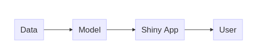
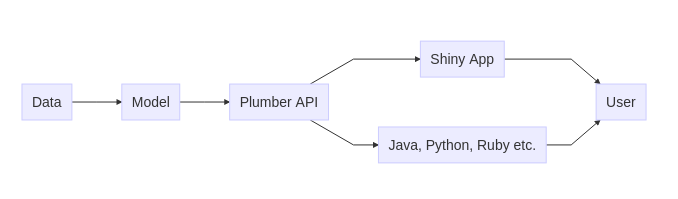
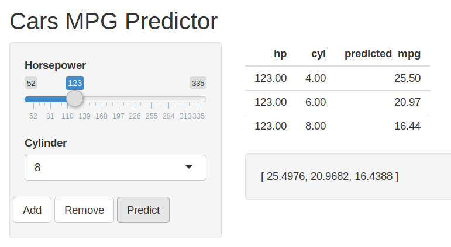

Workshop: Plumber APIs in R
================
Josef Petermann - eoda GmbH
13.06.2019

## Agenda:

  - Intro HTTP APIs und Plumber

  - Erstellen einer Plumber API aus Shiny App

  - Publishen der API zu RStudio Connect

  - Aufrufen des Modells via Httr /
Shiny


## HTTP (REST) APIs

  - Machine to machine (M2M) Kommunikation
  - Programmatisch konsumiert
  - Maschinenlesbare austauschformate (JSON, XML)
  - Von den meisten Programmiersprachen
unterstützt


## Use Case Shiny



Vermitteln von Informationen an
Menschen

## Use Case Plumber



Kommunikation zwischen Maschinen

## Plumber R-Paket

  - Open Source R Package
  - Auf CRAN (Comprehensive R Archive Network) verfügbar
  - Einfaches Erzeugen von APIs aus R Code mit speziellen
Kommentaren


## OpenAPI (swagger)

  - Standardisierte Spezifikation von REST Schnittstellen
  - Vollständige Dokumentation einer API mit Swagger UI
  - Voll unterstützt von
Plumber


## Hosting von Plumber APIs

  - RStudio Connect
      - Load Balancing / Skalierung
      - Zugriffskontrolle
      - API Keys
  - Docker
  - Digitalocean
  - Linux Server (systemd,
Rscript)

## Hands On: REST API mit Plumber


## Erstellung eines einfachen Modells

``` r
# Build simple model from mtcars dataset

## ---- cars-model
# Model ---- (insert fancy model here)
cars_model <- lm(mpg ~ cyl + hp,
                 data = mtcars)

# Save model ----
saveRDS(cars_model, here::here("R", "model-api", "cars-model.rds"))
```

Erstellen und Speichern eines einfachen linearen Modells

## API Setup

``` r
library(plumber)

# Load model
# Depending on model size, this can be a fairly expensive operation
cars_model <- readRDS("cars-model.rds")

#* @apiTitle mtcars model API
#* @apiDescription Endpoints for working with mtcars dataset model
```

Laden des R-Pakets `plumber` und des Modells `cars_model` in die globale
Umgebung

## Filtern des Requests

``` r
#* Log some information about the incoming request
#* @filter logger
function(req){
  cat(as.character(Sys.time()), "-",
      req$REQUEST_METHOD, req$PATH_INFO, "-",
      req$HTTP_USER_AGENT, "@", req$REMOTE_ADDR, "\n")
  forward()
}
```

Logging lässt sich via
[Filter](https://www.rplumber.io/docs/routing-and-input.html#filters)
realisieren

## Endpoints

``` r
#* Submit data and get a prediction in return
#* @post /predict
function(req, res) {
  data <- tryCatch(jsonlite::parse_json(req$postBody, simplifyVector = TRUE),
                   error = function(e) NULL)
  if (is.null(data)) {
    res$status <- 400
    return(list(error = "No data submitted"))
  }

  predict(cars_model, data)
}
```

Konvertieren der JSON-Daten aus `req$postBody` in einen `data.frame`
nach Überprüfung auf validen JSON `POST` Request. Anschließend Ausgabe
des MPG Wertes als JSON anhand des Modells aus `cars-model.R`

## Config Paket

``` r
default:
  base_url: "localhost:5762"
rsconnect:
  base_url: "http:/ec2-<Public-EC2-IP>/rsconnect"
```

Ablegen der aktuellen URL des Connect Servers

## Deployment der API

``` r
rsconnect::deployAPI(
    api = ".",
    # server = "{server}",     # <<- edit this line if necessary
    # account = "{account}",   # <<- edit this line if necessary
    appTitle = "plumber_model_api",
    forceUpdate = TRUE
  ))
```

## Konsumieren der Plumber API mit Shiny


## HTTP Request senden

``` r
# Make API request
    api_res <- httr::POST(url = paste0(base_url, "/predict"),
                          body = reactive_values$data,
                          encode = "json")
```

POST Request mit JSON Daten aus Shiny

## Verarbeiten der JSON Daten

``` r
# Extract JSON from API response
reactive_values$predicted_values <- httr::content(api_res, as = "text", encoding = "UTF-8")
...
#Add predicted values to data
if (!"predicted_mpg" %in% names(reactive_values$data)) {
  reactive_values$data <- cbind(reactive_values$data, 
  predicted_mpg = as.numeric(jsonlite::fromJSON(reactive_values$predicted_values)))
  }
```

Weiterverarbeiten der Daten mit
`jsonlite`

## Rendern des Outputs in Shiny



That’s it\!

## Fragen?

Plumber Webseite und Dokumentation: [rplumber.io](https://rplumber.io)

Folien und R-Code:
[https://github.com/eodaGmbH/ready\_for\_production](https://github.com/eodaGmbH/ready_for_production/tree/master/Plumber_APIs_in_R)

Quell-Repo plumber-model:
[github.com/sol-eng/plumber-model](https://github.com/sol-eng/plumber-model)
